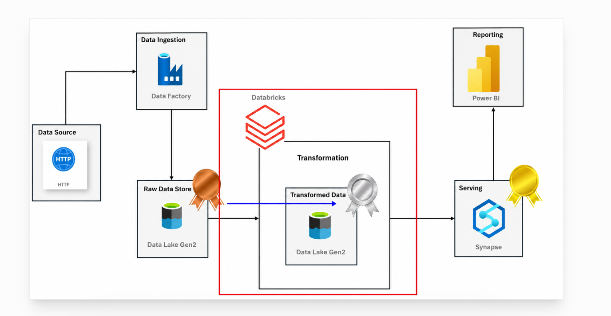

# azure-end-to-end-data-engineering-first
# Project Overview  
This project demonstrates an end-to-end Azure Data Engineering pipeline using the Medallion Architecture (Bronze, Silver, and Gold). Data is ingested from GitHub using Azure Data Factory, stored in ADLS Gen2, transformed with Azure Databricks (PySpark), loaded into Azure Synapse Analytics.

##  Technologies Used
- Azure Data Factory
- Azure Data Lake Storage Gen2
- Azure Synapse Analytics
- Azure SQL Database
- Python
- SQL
- Git & GitHub

##  Architecture

  

## Project Workflow
1. The raw dataset is stored in a GitHub repository.
2. Azure Data Factory ingests the data directly from GitHub.
3. The ingested raw data is stored in the **Bronze** container of Azure Data Lake Storage Gen2.
4. Azure Databricks reads the Bronze data and performs data cleaning and transformations.
5. The transformed data is written to the **Silver** container in Azure Data Lake Storage Gen2.
6. Azure Synapse Analytics accesses the Silver data and creates external tables for querying.
7. The final processed data is stored in the **Gold** container in Azure Data Lake Storage Gen2 for reporting and analytics.

